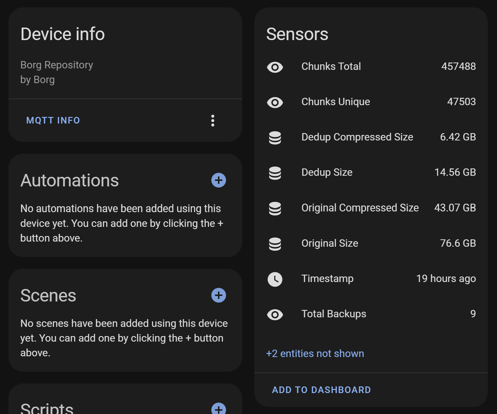

# Borg -> MQTT
Send borgbackup updates over MQTT, including support for Home Assistant MQTT autodiscovery. Sensors include

- Total/unique chunks
- (Un)compressed size
- Depuplicated (Un)compressed size
- Total number of backups
- Most recent backup



# Installation
Install on any system as python library using
```bash
pip install borg2mqtt
```
Whatever system it is installed on will need the ssh keys for your backup locations.

# Configuration
borg2mqtt reads MQTT and repository information from a configuration yaml file. An example configuration file can be generated by running
```bash
borg2mqtt -c path/config.yml generate
```
If portion `path/config.yml` is left off, borg2mqtt defaults to saving/looking for the configuration file at `$HOME/.config/borg2mqtt/config.yml`.

The configuration file is mostly self-explanatory and looks as follows:
```yaml
# -------------- Sample configuration file -------------- #
# These are the default MQTT values - none are required
mqtt:
  host: localhost
  port: 1883
  user: ""
  password: ""

# Put in as many repositories as desired
repos:
    # Required
  - repo: user@address:/path/to/backup
    # Optional, defaults to the same as repo if not specified
    # This will be used to make entity_ids in HA
    name: Local Data
    # Optional
    key: ""
    # Optional, choose one of kB, MB, GB, TB. Defaults to GB.
    units: GB
```

# Usage
To send the Home Assistant MQTT auto-discovery message, run
```bash
borg2mqtt setup
```

Then to update sensor information run
```bash
borg2mqtt update
```
This can be included in a cron job, borgmatic, etc to send updates as needed. As this is a "local push" option, it should be more efficient than any local polling option that could be included in Home Assistant.

Additionally, a single repository can be updated through it's name found in the configuration file by
```bash
borg2mqtt update -n "My Repo"
```

# Additional Options
All options can always be shown by using flag `--help`. Additionally, varying levels of verbose output can be included through `-vvv`, put before the command type.

# Contributing
All pull requests are more than welcome. Please usse the pre-commit hooks to verify your code before making a pull request. If any bugs are found, feel free to open an issue with your verbose output (`-vvv`) included.
